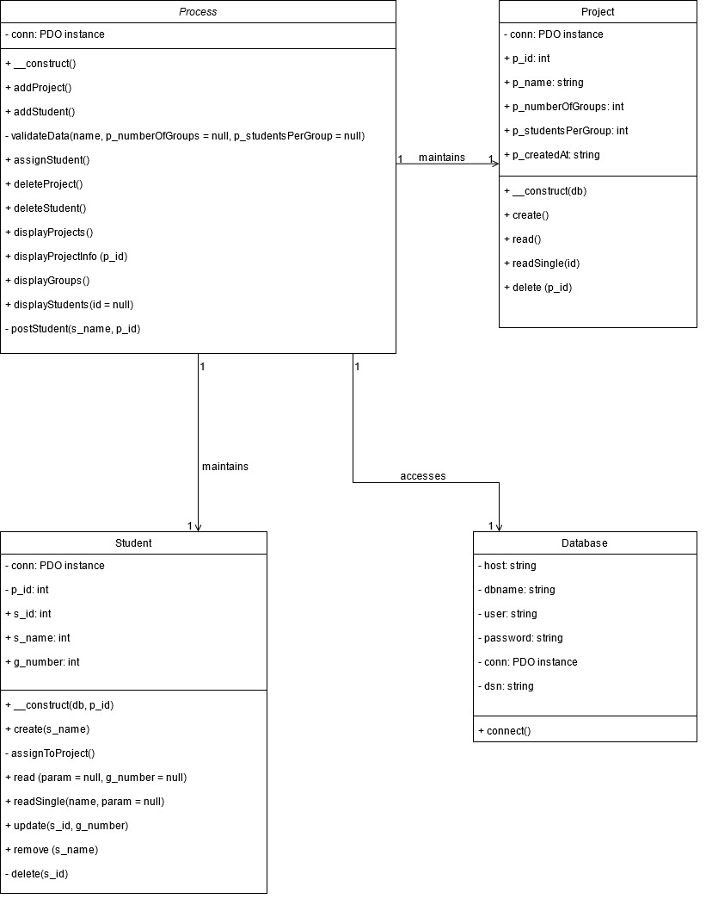

## What is this?
This project is made according to the specifications of a task that was given to me by NFQ. The project showcases my ability to create a CRUD application using OOP.

&nbsp;
## Quick start
1. Download this project as a .zip file.
2. Extract the folder "om_nfq-master" to the root directory of your server. The name of this folder must not be changed.
3. Import the database contained in "om_nfq.sql".
4. Configure the database connection through config &rarr; Database.php.
5. Access the application through your browser by visiting "localhost/om_nfq-master/".

&nbsp;
## The task
_We need an application for a teacher to assign students to groups for a project. Please read the requirements below and implement a solution that meets them. You will also find a mockup of a project status page that you can follow when implementing your design._

&nbsp;
## Technical requirements
No. | Requirement | Status | Comment
-|-|-|-
1 | _Include a README file that contains a short description of your solution and technical decisions._ | Complete | -
2 | _Project must be stored in a publicly accessible git repository in GitHub or BitBucket._ | Complete | -
3 | _All data should be stored in MySQL database. You must provide a script to create an initial schema for the database._ | Complete | -
4 | _Task must be implemented as a web application using OOP principles with PHP, Java or Python programming languages for the backend. JavaScript and CSS can be used for front-end._ | Complete | PHP chosen.

&nbsp;
## Functional requirements
No. | Requirement | Status | Comment
-|-|-|-
1 | _On first visit a teacher should create a new project by providing a title of the project and a number of groups that will participate in the project and a maximum number of students per group. Groups should be automatically initialized when a project is created._ | Complete | -
2 | _If the project exists, a teacher can add students using the “Add new student” button. Each student must have a unique full name._ | Complete | -
3 | _All students are visible on a list._ | Complete | -
4 | _Teacher can delete a student. In such a case, the student should be removed from the group and project._ | Complete | -
5 | _Teacher can assign a student to any of the groups. Any student can only be assigned to a single group. In case the group is full, information text should be visible for a teacher._ | Complete | -

&nbsp;
## Bonus requirements
No. | Requirement | Status | Comment
-|-|-|-
1 | _Make information on the status page to automatically update every 10 seconds._ | Complete | Implemented with AJAX. Information can also be updated with a button. Automatic refresh when a student is assigned to a group. Refresh is delayed until user finishes selection.
2 | _Implement functional requirement #2 using RESTful API._ | Complete | -
3 | _Add automated test for functional requirement #4._ | Complete | Implemented with PHPUnit 9. Once PHPUnit is installed, open terminal, go to the project directory and launch the test by typing "vendor/bin/phpunit" (no quotes).

&nbsp;
## My own extras
1. Client and server side data validation. The user may not input project or student names that exceed 255 characters. Number of groups, students per group expected to range from 2 to 100.
2. Data cleanup - HTML tags and special characters are stripped, therefore the user may not manipulate the page in an unwanted way (for example, it is impossible to use an HTML bold tag for the project / student name).
3. Database is accessed with prepares for improved security.

&nbsp;
## Database
I chose to use a junction table (a table with two foreign keys) in order to prevent data duplication.

There is no group table, group information (g_number) is stored in p_s_junction table.

Entity relationship diagram:

Implementation in PHPMyAdmin:

&nbsp;
## Class diagram

&nbsp;
## Design
The design is based on the provided status page mockup.

The user is notified about system functionality through JavaScript alert() messages.

On the status page, there is a side menu with home and refresh buttons. I implemented an automatic refresh timer below the refresh button.

